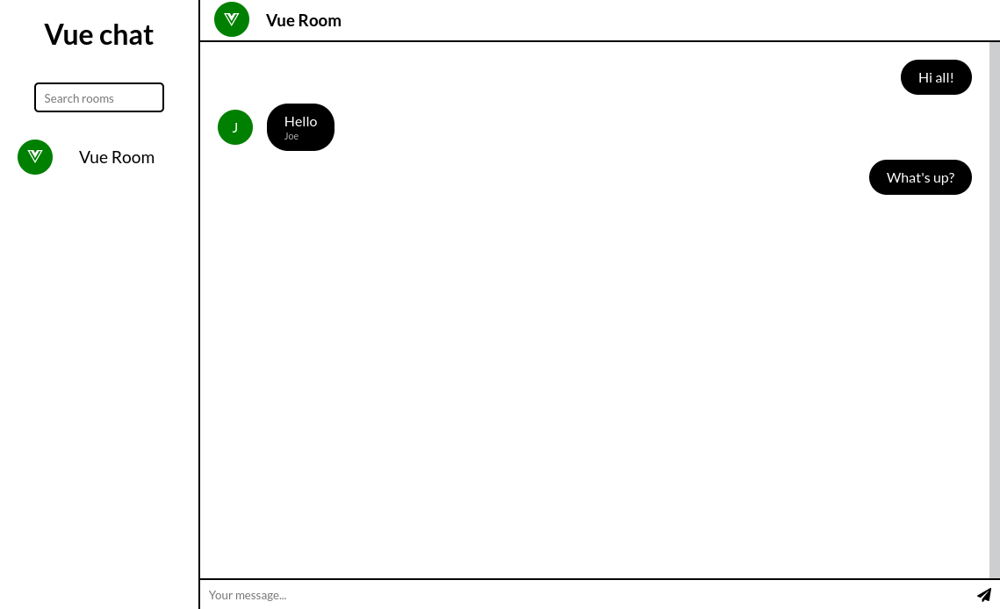

# Vue-Chat
[Open Vue Chat](https://vue-chat-c04db.web.app/)
## What is it?
A simple web application that allows you to communicate with others using rooms. The project uses Firebase to exchange messages.

The application was created just to get familiar with the Vue framework, it is not intended for production use.